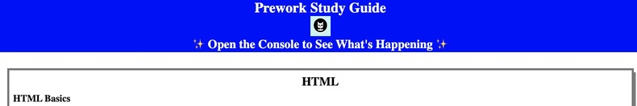
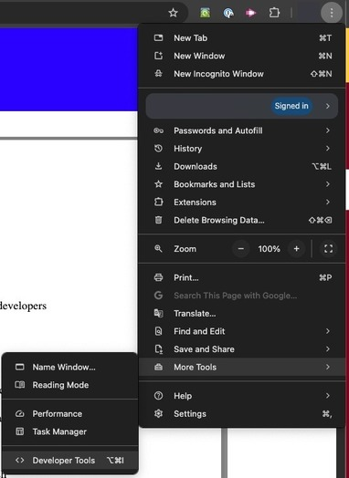
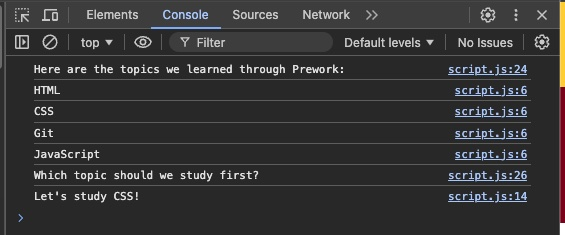

# Prework Study Guide Webpage for University of Minnesota + edX Bootcamp Prework Notes

## Description

This Prework Study Guide was created for UoM Bootcamp students who were going through the Prework, in addition to being a great reference point for the basics in the subjects it contains. It contains detailed notes on HTML, CSS, Git, and JavaScript. 

The project was built with the heavy intention to give a detailed yet concise source for all the notes taken during the prework modules. It allowed a very structured and organized place for the notes, in addition to formatting options that a word processor may not easily give (ie. the  <code>&lt;code&gt;</code> and <code>&lt;pre&gt;</code> elements).

This solves the issue of having to comb through pages of notes, in addition to multiple documents of notes, by having them in a single, organized space.

This project helped teach many formatting and basic coding techniques for the languages it is written in. Additionally, it helped teach techniques that were not included in the base code or lessons.

## Table of Contents

- [Installation](#installation)
- [Usage](#usage)
- [Credits](#credits)
- [License](#license)
- [Features](#features)

## Installation

No installation is needed, simply follow this link to access the webpage:\
https://jsparrowio.github.io/prework-study-guide/

## Usage

To use this study guide, follow the link above, and then simply choose which subject you would like to study first. Then, go to that section, and read the respective notes on the subject.

For suggestions on what to study first, open the console in your web browser (for Chrome, this would be under Menu>More Tools>Development Tools) when on the webpage, and then there will be a "What topic should we study first?" line, to which underneath will have a suggestion on what to study first.

 

## Credits

All base code and content provided by edX and their respective developers. Additional written code and content by Josh Garrett (jsparrowio) with heavy guidance and influence from the edX/UoM Bootcamp Modules, in addition to other educational or open sources.

## License

MIT License\
Please refer to the LICENSE in the repo for additional information.

## Features

The main feature of this webpage is to be used as a study guide, not only for the Bootcamp prework, but also for basic notes for HTML, CSS, Git/GitHub, and JavaScript.

It also features the ability to select a topic for you to study in the console.\ 
See the instructions under "usage" for the latter. 